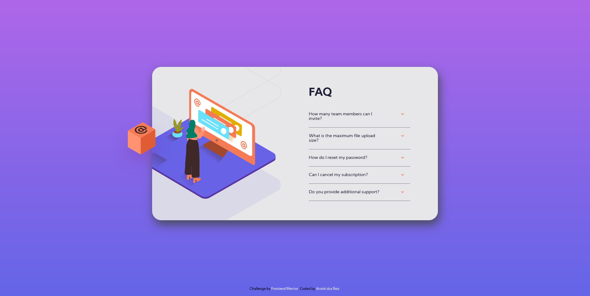

# Frontend Mentor - FAQ accordion card solution

This is a solution to the [FAQ accordion card challenge on Frontend Mentor](https://www.frontendmentor.io/challenges/faq-accordion-card-XlyjD0Oam). Frontend Mentor challenges help you improve your coding skills by building realistic projects. 

## Table of contents

- [Overview](#overview)
  - [The challenge](#the-challenge)
  - [Screenshot](#screenshot)
  - [Links](#links)
- [My process](#my-process)
  - [Built with](#built-with)
  - [What I learned](#what-i-learned)
  - [Useful resources](#useful-resources)
- [Author](#author)
- [Acknowledgments](#acknowledgments)

**Note: Delete this note and update the table of contents based on what sections you keep.**

## Overview

### The challenge

Users should be able to:

- View the optimal layout for the component depending on their device's screen size
- See hover states for all interactive elements on the page
- Hide/Show the answer to a question when the question is clicked

### Screenshot

### Links

- [Solution URL](https://github.com/andrebdosreis/FEM-NEW-faq-accordion-card-main)
- [Live Site URL](https://andrebdosreis.github.io/FEM-NEW-faq-accordion-card-main)
- 
## My process

### Built with

- Semantic HTML5 markup
- CSS custom properties
- Flexbox
- JavaScript

**Note: These are just examples. Delete this note and replace the list above with your own choices**

### What I learned

This challenge was important to study about working with arrays and "toggles" in JavaScript.

### Useful resources

- [B7 Web](https://www.b7web.com.br) - B7Web is an online web developer course from Brazil. So i learned how to write HTML and CSS codes studying B7Web's classes.

## Author

- Website - [André dos Reis](https://www.andredosreis.com.br)
- Frontend Mentor - [@andrebdosreis](https://www.frontendmentor.io/profile/andrebdosreis)
- Twitter - [@andrebdosreis](https://www.twitter.com/andrebdosreis)

## Acknowledgments

Thanks FrontEndMentor.io for challenge. I'm learning a lot with you.
